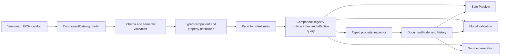

# Phase 6 Implementation Plan

## Purpose and status

This document is the detailed execution plan for Phase 6 of
MatlabAppClassDesigner. The Phase 6 section of `IMPLEMENTATION_PLAN.md` remains
the architectural and completion contract; this file records the implementation
order, concrete work packages, verification gates, and progress so the work can
be resumed without reconstructing prior design decisions.

**Status: in progress (6.1 through 6.6 complete, assessed 2026-08-12).**

**Target MATLAB release: R2024a.**

## Outcomes

Phase 6 will deliver:

- A strict, versioned JSON catalog containing the standard component and
  property specifications currently hard-coded in `ComponentRegistry.m`.
- A fail-closed loader that validates the catalog and constructs typed runtime
  definitions without executing catalog-provided code.
- A categorized inspector with typed editors for common and component-specific
  properties.
- Model-owned property add, change, and reset operations with undo/redo.
- Safe Preview updates and localized source edits for approved properties.
- An audited disposition for every candidate property of every Phase 4.5
  component and supported style.

Phase 6 does not execute input applications, evaluate arbitrary expressions,
install user callbacks on preview handles, copy referenced assets, or infer new
catalog support from the MATLAB release that happens to run the editor.

## Invariants

1. `DocumentModel` owns editable document state. Inspector controls and preview
   handles are disposable views.
2. `PropertyDefinition` describes capability; `PropertyEntry` describes one
   component instance. Unassigned, explicit literal, and source-backed
   nonliteral states remain distinct.
3. JSON contains declarative data only and cannot request arbitrary MATLAB code.
4. Catalog loading is atomic: one error prevents returning the entire registry.
5. Opened source is not executed; unknown and nonliteral source is preserved.
6. Selecting a component does not add redundant default assignments.
7. Existing source changes only through unambiguous owned spans and anchors.
8. Project-owned MATLAB source and tests retain the documented help, GPL,
   UTF-8-without-BOM, and CRLF requirements.

## Target architecture



Anticipated structure:

```text
resources/
  component-catalog/
    v1/
      catalog.json
      property-groups/
      components/
+macd/
  +catalog/
    ComponentCatalogLoader.m
    CatalogValidator.m
    PropertyBehaviorRegistry.m
  +model/
    ComponentRegistry.m
    ComponentDefinition.m
    ParentContextRule.m
    PropertyDefinition.m
    PropertyEntry.m
    DocumentModel.m
  +ui/
    +inspector/
      PropertyEditorFactory.m
      ... typed editor adapters ...
tests/
  fixtures/
    componentCatalog/
  unit/
```

Names in the new packages may be adjusted when the first slice establishes the
smallest useful API, but parsing, schema validation, behavior resolution, editor
construction, and model mutation remain separate responsibilities.

## JSON catalog contract

### Manifest and file boundaries

`resources/component-catalog/v1/catalog.json` owns the schema version, target
MATLAB release, ordered property-group list, and ordered component-file list.
There is one component file per factory. The loader does not enumerate folders,
so ordering and omissions remain explicit and reviewable.

### Deterministic composition

Definitions are composed in this order:

1. Referenced shared property groups.
2. Component-local properties.
3. Style-specific additions, exclusions, and explicit overrides.

Duplicate factories, paths, or implicit overrides are errors. An override names
an existing definition and declares its intent. Property groups may not cycle,
and component files do not form unrestricted inheritance graphs.

### Parent-dependent property applicability

Intrinsic definitions omit geometry supplied only by a direct parent. An
allowlisted context rule composes the effective surface after component/style
validation: Grid adds `Layout.Row` and `Layout.Column` and suppresses
`Position`; ordinary absolute parents add `Position`; structural parents add no
geometry unless explicitly reviewed. Hierarchy order and container references
remain separate relationship capabilities. Context-inapplicable opened-source
assignments are preserved read-only.

### Data and behavior boundary

Ordinary values use standard JSON strings, logicals, finite numbers, arrays, and
objects. A MATLAB-specific value is allowed only through a schema-approved tagged
form parsed at the safe literal boundary. Catalog files never contain executable
MATLAB expressions.

Editor and validator fields contain symbolic identifiers such as `text`,
`rgbColor`, or `normalizedRgb`. `PropertyBehaviorRegistry` resolves only known
identifiers to project-owned implementations. Unknown identifiers fail loading;
the loader does not use `eval`, deserialize function handles, or invoke arbitrary
names through `str2func`.

### Validation and diagnostics

The loader rejects unknown or missing fields, unsupported schema versions,
duplicates, missing group/override targets, cycles, malformed defaults and
ranges, unknown behavior identifiers, invalid parent/style declarations, and
missing audit dispositions or omission reasons. Every error identifies its
catalog file and logical JSON path. No partial registry escapes a failed load.

## Work packages

### 6.1 Freeze the Phase 4.5 catalog baseline

- [x] Record a deterministic projection of every current registry definition.
- [x] Include factories, declared types, parents, creation arguments, properties,
  styles, overlay metadata, and resize constraints.
- [x] Add a baseline test insensitive to incidental struct-field ordering.

**Exit gate:** the current implementation reproduces a reviewed baseline under
licensed MATLAB R2024a.

**Completion record (2026-08-11):**
`tests/fixtures/componentCatalog/phase45-registry-baseline.json` freezes 38
factory definitions in a canonical JSON projection. `ComponentRegistryBaselineTest`
compares the runtime projection after sorting factories and recursively ordering
structure fields; it also parses the fixture independently. The licensed R2024a
run passed 2 baseline tests and 2 project-convention tests with zero failures.

### 6.2 Implement the JSON schema boundary and loader

- [x] Define schema version 1, manifest, component/group documents, and strict
  style-override records. Expanded typed/audit fields remain owned by 6.5.
- [x] Add explicit fixture catalog-root injection and packaged-resource lookup.
- [x] Implement strict validation, deterministic composition, `jsondecode`
  normalization, allowlisted behavior resolution, and atomic failure.
- [x] Create isolated minimal valid and intentionally invalid test catalogs.

**Exit gate:** a fixture catalog constructs typed definitions without the
hard-coded standard catalog.

**Completion record (2026-08-11):** `ComponentCatalogLoader` and
`PropertyBehaviorRegistry` passed 5 loader tests, 2 baseline tests, and 2
project-convention tests under licensed R2024a. Commit: `9914aaa`.

### 6.3 Introduce parent-dependent property rules

- [x] Extend schema version 1 with allowlisted direct-parent context kinds and
  typed contributed/suppressed property rules.
- [x] Add one registry query such as `getEffectiveProperties(factory,
  parentFactory)` and prohibit duplicated consumer-side parent conditionals.
- [x] Define Grid context to add `Layout.Row`/`Layout.Column` and suppress
  `Position`; define ordinary absolute context to add `Position` only.
- [x] Define structural contexts for tab groups, button groups, trees, menus,
  and toolbars so broad property groups do not advertise invalid geometry.
- [x] Switch `DocumentModel.insertComponent`, `AppSourceParser` property
  recognition, and `ModelValidator` applicability checks to the shared query.
- [x] Preserve context-inapplicable opened-source assignments as read-only.
- [x] Split the 6.1 baseline into intrinsic definitions and representative
  direct-parent effective projections.
- [x] Eliminate the duplicate `uispinner` `Layout.Row`/`Layout.Column` entries
  through contextual composition rather than a compatibility exception.

**Required tests:** Grid/absolute insertion, nested Grid, deterministic effective
order, structural children, parser retention, invalid-parent diagnostics, and
canonical intrinsic/effective projections.

**Exit gate:** insertion, parsing, and validation resolve the same parent surface
without losing supported Grid placement or advertising invalid geometry.

**Completion record (2026-08-11):** Added `ParentContextRule`, the registry
effective-property query, Grid/absolute/structural contexts, insertion/parser/
validator integration, and strict JSON manifest loading of allowlisted rules.
The completion verification, including the safe inspector display regression,
passed 60 licensed R2024a tests with zero failures. Commits: `db5433f`,
`4798cd8`, `02196de`.

### 6.4 Migrate the Phase 4.5 component catalog

- [x] Create the manifest and shared intrinsic property groups.
- [x] Move every existing factory into one component JSON file.
- [x] Compare intrinsic and direct-parent effective projections with the revised
  frozen Phase 4.5 baselines.
- [x] Delegate `ComponentRegistry.createDefault()` to the loader.
- [x] Remove hard-coded inventory only after both parity layers pass.
- [x] Verify parser fixtures, palette order, styles, overlays, and resize
  constraints remain unchanged.

**Required tests:** intrinsic/effective parity, existing registry/model/parser/
preview tests, and real editor construction, `drawnow`, validity, and deletion.

**Exit gate:** JSON is the only standard catalog source with no effective Phase
4.5 behavior change or duplicate MATLAB fallback.

**Completion record (2026-08-11):** Migrated all 38 standard factories into
`resources/component-catalog/v1`, removed parent-dependent geometry from static
component definitions, and declared Grid, absolute, and structural contexts in
the manifest. Intrinsic definitions and every allowed direct-parent effective
surface are frozen independently. The licensed R2024a full suite passed after
migration.

### 6.5 Expand typed capabilities and reset history

- [ ] Add display/category/order, value schema, editor/validator identifiers,
  defaults, style/preview applicability, audit disposition, and reset policy to
  `PropertyDefinition`.
- [ ] Join effective definitions with entries without materializing defaults.
- [ ] Add model-owned property removal/reset and typed history for absent,
  literal, and source-backed states.
- [ ] Define safe removal rules for generated and parsed assignments.

**Required tests:** conversion, invalid definition rejection, absent versus
explicit state, add/change/reset undo/redo, redo-branch clearing, and parsed-state
restoration.

**Exit gate:** model tests prove all state transitions without UI or preview
handles as storage.

### 6.6 Build the categorized inspector framework

Phase 6.6 uses a simple native-control lifecycle. The inspector does not cache,
rebind, or diff individual controls across different selected components. It
rebuilds all category sections and property rows only when selection moves to a
different component or the selected component's effective property surface
changes. Re-selecting the current component and changing values, geometry,
validation, Preview, or history state update existing rows without rebuilding
them. This keeps lifecycle and callback ownership explicit while avoiding work
during frequent same-component edits.

The current effective-property `uitable` is a transitional integration surface.
It proves the model/registry join but is removed when the native categorized
view lands; it is not the final typed-editor implementation.

#### 6.6.1 Freeze inspector lifecycle and rebuild triggers

- [x] Introduce an inspector surface key containing component identity, factory,
  style, direct-parent factory, and the ordered effective-definition signature.
- [x] Split the current refresh path into `rebuildInspector` and
  `refreshInspectorValues` responsibilities.
- [x] Rebuild only when the selected component identity or surface key changes;
  make a repeated selection event for the current component a no-op.
- [x] Route drag/resize, property commit/reset, validation, Preview refresh, and
  undo/redo for the current surface through value/diagnostic synchronization.
- [x] Clear inspector view state and controls deterministically on New, Open,
  component deletion, and application destruction.

**Completion record (2026-08-11):** Added a surface key based on selected
component identity, factory, style, direct parent, ordered effective properties,
and source-only rows. Repeated hierarchy selection is a no-op; same-surface
refreshes synchronize values, while selection/surface changes take the rebuild
path. New and Open clear transient inspector state. The licensed R2024a editor,
model, and convention tests passed 24 tests with zero failures.

**Gate:** tests observe stable editor-control identity during same-component
updates and a complete replacement when selection or the effective surface
changes. No adapter callback retains a previously selected component ID.

#### 6.6.2 Build the native scrollable inspector shell

- [x] Replace `InspectorTable` with one native scrollable container and an inner
  single-column layout that owns category sections.
- [x] Add lightweight `InspectorView`, `InspectorCategorySection`, and
  `InspectorPropertyRow` responsibilities under `+macd/+ui/+inspector` rather
  than expanding component-specific logic in `MatlabAppClassDesigner`.
- [x] Build a selected component's complete control tree off the active update
  path where practical, publish it once, and avoid `drawnow` inside row loops.
- [x] Verify the public R2024a scrolling API used by the chosen native container
  with real construction, `drawnow`, validity, and deletion tests. If no public
  scroll-position API exists, retain position by avoiding same-surface rebuilds,
  reset position on replacement, and do not use undocumented UI internals.

**Gate:** switching between representative small and large effective surfaces
constructs one valid inspector tree with no leaked controls, callbacks, or
timers; ordinary selection remains responsive under an observed smoke test.

**Completion record (2026-08-11):** Replaced the transitional table with a
scrollable `InspectorView` containing disposable category sections and native
property rows. Rows bind their selected component ID and property path locally,
then delegate commits to the application. Same-surface refresh synchronizes row
values without replacing their controls. R2024a has no public scroll-position
property for this container, so replacement resets the position and normal
same-surface edits retain it. Licensed R2024a construction, hierarchy-selection,
and destruction coverage passed 9 tests with zero failures. Commit: `4a43417`.

#### 6.6.3 Render definition-driven categories and rows

- [ ] Extend and validate typed definition fields for category ID/display name,
  property display name, order, description/help, editor identifier, validator,
  audit disposition, style scope, preview policy, and reset policy.
- [ ] Sort categories and properties deterministically from catalog order data;
  do not infer categories from property paths in the UI.
- [ ] Render a consistent row structure containing label, editor host, optional
  reset action, inline diagnostic area, and explicit/default/read-only state.
- [ ] Append retained catalog-inapplicable or unknown opened-source entries to a
  dedicated Source category without evaluating or discarding them.

**Gate:** categories and row order are entirely definition-driven, and the
inspector contains no factory- or component-specific property conditionals.

#### 6.6.4 Define the adapter contract and allowlisted factory

- [ ] Define a project-owned adapter interface for control creation, model-to-UI
  loading, pending-text retention, validation, commit/reset availability,
  read-only presentation, focus, and deterministic cleanup.
- [ ] Resolve only allowlisted editor identifiers through
  `PropertyEditorFactory`; never use `eval`, `str2func`, or JSON class names.
- [ ] Keep current component/path binding in the property-row controller so
  adapters remain value editors and cannot mutate documents directly.
- [ ] Provide a read-only/unsupported adapter as a fail-closed presentation path
  for audited visible values that have no editable adapter.

**Gate:** unknown editor identifiers fail catalog loading, and every constructed
row owns exactly one adapter whose cleanup releases all listeners and controls.

#### 6.6.5 Implement common scalar adapters

- [ ] Implement text and multiline-text adapters.
- [ ] Implement logical and MATLAB `on`/`off` adapters using check boxes with
  explicit conversion rather than storing UI logicals accidentally.
- [ ] Implement enum adapters using definition-provided choices.
- [ ] Implement scalar-number adapters with definition-provided finite/range/
  integer constraints and retained invalid editor text.
- [ ] Add keyboard commit/cancel behavior consistently across scalar editors.

**Gate:** text, logical, on/off, enum, and scalar-number tests exercise real
controls and prove successful conversion, failed conversion, commit, reset,
undo, redo, and read-only behavior.

#### 6.6.6 Implement structured-value adapters

- [ ] Implement fixed/variable numeric-vector editing, including `Position`,
  limits, ticks, padding, and Grid row/column spans.
- [ ] Implement RGB color editing with a native color action plus an exact
  numeric representation that can round-trip.
- [ ] Implement string/item-list editing through a compact row summary and a
  dedicated native editor dialog; preserve row/column string-array shape where
  the schema requires it.
- [ ] Keep table data, mixed Grid size lists, datetime, file/image paths,
  component references, callbacks, and other specialized values on explicit
  read-only/fallback adapters until their later audited phases.

**Gate:** vector, color, and string-list adapters round-trip supported values and
show a typed read-only fallback for every deferred structured value.

#### 6.6.7 Connect validation, model mutation, reset, and history

- [ ] Store uncommitted editor text and inline diagnostics only in inspector view
  state; the document, Preview, and generators continue using the last valid
  committed value.
- [ ] Validate through named validators before calling
  `DocumentModel.setProperty`; failed edits change neither model nor history.
- [ ] Route reset through model-owned reset/removal rules, display effective
  defaults without materializing entries, and explain disabled parsed resets.
- [ ] Coalesce a continuous editor gesture into one history record while keeping
  discrete commits separate and clearing redo branches correctly.
- [ ] Synchronize successful commit/reset/undo/redo back into existing rows
  without rebuilding the current surface.

**Gate:** model tests cover absent, literal, and source-backed states, while UI
tests prove inline errors retain user input and valid history transitions do not
replace editor controls.

#### 6.6.8 Preserve per-component transient view state

- [ ] Save collapsed category IDs, scroll position only when exposed by a
  verified R2024a public API, focused property, and pending invalid editor text
  before a selected component's control tree is destroyed.
- [ ] Restore compatible category, focus, and pending-text state when returning
  to that component; restore scroll position only when the public API supports
  it, otherwise reset it after rebuilding.
- [ ] Keep this cache editor-owned and clear it on document replacement or
  component deletion; never serialize it as document or generated-source state.
- [ ] Preserve state automatically during same-component value refresh by not
  rebuilding the control tree.

**Gate:** selection A -> B -> A restores compatible category/focus/draft state
and restores scrolling where a public API supports it; repeated A -> A does not
rebuild, and New/Open cannot inherit state from the prior document.

#### 6.6.9 Remove the transitional table and complete integration

- [ ] Remove `InspectorTable`, `InspectorPaths`, table cell-edit routing, and
  obsolete formatter-only assumptions after native rows cover their behavior.
- [ ] Keep unsupported literals and nonliteral expressions visible through the
  new read-only adapter with typed `<unsupported: ...>` summaries where useful.
- [ ] Run real editor construction/draw/deletion tests for every adapter,
  selection lifecycle, categories, inline validation, reset, and history.
- [ ] Run the licensed R2024a full suite and record actual counts, observed
  selection responsiveness, known deferred adapters, and completion commits.

**Required tests:** real editor construction/draw/deletion, every adapter,
rebuild/no-rebuild triggers, retained UI state, inline errors, read-only values,
reset, history, and deterministic cleanup.

**Exit gate:** the inspector has no component-specific conditionals; definitions
select every implemented editor. Different-component selection rebuilds a clean
native control tree, while same-component edits synchronize values without
rebuilding or losing transient editor state.

**Completion record (2026-08-12):** The native inspector renders definition-
driven categories and retained Source rows, with an allowlisted editor factory
for text, logical/on-off, enum, scalar number, numeric-vector, RGB color, and
string-list values. Deferred editor kinds remain readable through the typed
read-only fallback. Failed commits keep their draft and inline error outside the
document model; returning from another selected component restores compatible
invalid drafts and best-effort focus. The scrollable R2024a panel exposes no
public scroll-position API, so replacement resets scrolling. The user-directed
decision is to omit a permanent Reset button; `DocumentModel.resetProperty`
remains available for a later context-menu action. The obsolete table formatter
was removed. Licensed MATLAB R2024a verification passed 76 tests with zero
failures. Completion commits include `66e9bad`, `4a43417`, `2421893`,
`117459f`, `df2429c`, `e17f220`, `1ef58dd`, `2163afd`, `a4f55b8`, `86a21dd`,
and `d8367ed`.

#### 6.6.10 Resolve runtime defaults without catalog duplication

- [x] Add a `DefaultValueProvider` that reads declared defaults from metadata
  where available, then probes only allowlisted standard factories in a hidden,
  editor-owned fixture hierarchy when metadata has no value.
- [x] Key cached values by MATLAB release, factory, direct-parent context,
  style, creation arguments, and property path. Never execute opened-source
  code, callbacks, or catalog-provided code.
- [x] Return display-only defaults without adding `PropertyEntry` objects,
  history records, Preview assignments, or generated source. Preserve an
  explicit/source-backed entry over any resolved default.
- [x] Treat handles, callbacks, dependent values, unsupported literals, and
  failed probes as unavailable/read-only display values rather than coercing
  them into source literals.
- [x] Add fixture construction, cleanup, parent/style variance, cache, and
  no-materialization tests under licensed MATLAB R2024a.

**Exit gate:** unassigned inspector rows show applicable runtime defaults from
one controlled provider, while the standard JSON catalog remains capability and
editor metadata rather than a duplicate table of MATLAB defaults.

**Completion record (2026-08-12):** `DefaultValueProvider` first queries
MATLAB class metadata and otherwise creates only registry-approved components
inside an editor-owned hidden fixture hierarchy. Results are cached by MATLAB
release, factory, direct parent, style, creation arguments, and property path. The inspector uses these
values only when no explicit/source-backed entry exists; it does not materialize
properties, history, Preview assignments, or generated source. Unsupported
fixture contexts and handle/function values fail closed. Licensed R2024a tests
covered root/control display, Grid `Layout.Row`, cache reuse, and document
non-materialization; the full suite passed 79 tests with zero failures. Commits:
`c954080`, `e062d8f`.

### 6.7 Design shared category surfaces and order profiles

Follow `dev/component-data/PROPERTY_GROUPING_GUIDELINES.md` against the complete
R2024a concrete-variant ledger before promoting another family into the runtime
catalog.

- [x] Generate exact category-surface clusters from ordered property paths and
  audited capability signatures.
- [x] Explain same-name category conflicts and distinguish exact shared groups,
  family groups, justified core/extension splits, and variant-local categories.
- [x] Design stable group IDs without copying parent-contributed layout
  properties into intrinsic component groups.
- [x] Derive reusable family category-order profiles from the documented
  sequences. Keep the documented order in the audit ledger, but make runtime
  variants record only justified profile deltas wherever practical.
- [x] Map every concrete variant to groups, an order profile, and local deltas.
- [x] Expand the proposed representation for intrinsic and supported parent
  contexts and compare it mechanically with the audited ledger.

**Required evidence:** exact-cluster/conflict report, reviewed group and profile
mapping, explicit exceptions, and automated expansion parity covering every
R2024a concrete variant.

**Exit gate:** every audited property is owned exactly once after expansion,
every variant has deterministic category and property order, dependencies and
parent-context rules remain valid, and no capability metadata drifts from the
expanded ledger.

**Completion record (2026-08-15):** The R2024a ledger derives 313 reviewed
groups and five reusable order profiles for all 48 concrete variants. Expansion
parity passes for all 48 intrinsic surfaces and all 144 supported direct-parent
contexts. The category-sharing classification, judgment record, order-profile
design, and parity artifacts remain reproducible development inputs. Commits
include `19033ae`, `fb45878`, `98678de`, `4980c07`, `9c09dc9`, and `f3c9d39`.

### 6.8 Promote audited component families systematically

- [x] Promote broadly shared structural categories and order profiles before
  family-specific properties.
- [x] Promote common controls and containers, including push and state Button as
  representative variants rather than a one-off catalog design.
- [x] Promote navigation and data controls.
- [x] Promote axes and safely supported programmatic axes.
- [x] Promote instrumentation components and supported styles.
- [x] Promote HTML and Figure Tools.
- [x] Mark every candidate editable, visible read-only, or omitted with a reason.

Each family lands with JSON, shared-group changes, adapters/validators, registry
tests, representative Preview comparisons, generator tests, and grouped-surface
parity against the R2024a ledger. Shared category/order definitions must be
reused when their audited signatures match; family or variant differences must
remain explicit.

**Exit gate:** every Phase 4.5 factory/style has a complete audit and is promoted
through the grouped runtime catalog. Each property has a reviewed disposition
and required editor kind. Common adapters work end to end; the explicitly
identified specialized adapters are the owned scope of Phase 6.9 rather than an
unrecorded exception to this gate.

**Completion record (2026-08-15):** All 38 factories and 48 concrete variants
are promoted through the version 2 grouped runtime catalog with deterministic
category order. The registry, defaults provider, existing inspector adapters,
Preview, and source paths consume the promoted definitions. Enum and multiline
surfaces were re-audited before specialized-editor work; the licensed R2024a
suite passed 93 tests with zero failures. Specialized asset, URL, date/time,
structured-data, and table editors remain explicitly assigned to Phase 6.9.
Commits include `f9d3b3c`, `17d79c8`, `94dcba3`, `436cd91`, `62e8bac`,
`cba3c9a`, and `520db80`.

### 6.9 Add audited specialized value editors

Implement each editor as a vertical slice: correct its development-ledger
contract first, regenerate grouping/runtime catalog data, then add only the
Inspector, model/history, literal, Preview, and source-generation behavior that
the audited contract requires. Every slice ends with real control/dialog
construction, `drawnow`, destruction, round-trip, invalid-input, and focused
integration tests before its feature commit.

**Remaining status and execution order (2026-08-20):** Multiline text, URL,
asset, generic finite structured data, and the paired `ItemsData` editor are
implemented. Date/time, table-data, column-settings, and final integration are
still pending. Until those slices land, their catalog entries deliberately use
the Inspector's readable, disabled fallback instead of pretending that a typed
editor exists.

Complete the remaining work in this order:

1. Re-audit the exact R2024a value contracts used by the three pending editors.
   The current `dateTime` contracts still contain provisional broad classes and
   `shape: any`; the `uitable.Data` and column-setting contracts are likewise
   too coarse to drive a safe UI directly.
2. Add the shared transaction and collection-state logic described in
   6.9.5, then selectively retrofit the existing dialog editors that already
   implement the same mechanics. Validate a complete candidate state before
   changing the document.
3. Implement the scalar, limits, and disabled-date modes in 6.9.5.
4. Implement the table-data dialog in 6.9.7, including structural reconciliation
   of every affected row- and column-indexed property.
5. Implement the column-settings dialog in 6.9.8 on the same atomic mutation
   path.
6. Finish deferral, round-trip, and full-suite records in 6.9.9.

Commonize stable value and mutation logic rather than dialog widgets. Share
model-owned atomic property batches, prospective candidate-state validation,
pure draft collection operations, effective related-property resolution, typed
cell parsing/formatting, and structured validation results containing a property
path or cell coordinate. Each editor remains responsible for presenting those
results with controls appropriate to its value type. Temporal conversion,
heterogeneous table reconstruction, and column-setting normalization remain
separate policy adapters built on the shared primitives.

Apply the logic support retrospectively where it removes existing duplication
without changing an editor's UI or value contract. Extract the per-cell safe
literal conversion currently embedded in `ItemsDataEditorDialog` into a
configurable typed-cell codec for both ItemsData and table-data. Continue using
the existing `MatlabLiteralParser` and `LiteralEncoder` foundation from
`StructuredDataEditorDialog` and `StringListEditorDialog`, moving only repeated
accepted-type validation into value adapters when duplication actually appears.
Generalize the current Items-only related-value resolution so existing
ItemsData, table-data, and column-settings consume the same effective-state
snapshot. Keep existing dialog layouts, buttons, focus handling, and inline
single-property commit behavior local to their editors.

#### 6.9.1 Correct and freeze specialized-editor ledger contracts

- [x] Mark `uihtml.Data` visible read-only for this phase. It accepts arbitrary
  MATLAB data and must not inherit a table-data editor merely because several
  documented classes are tabular.
- [x] Mark `uitable.Selection` and `uitable.SelectionType` omitted with
  `lowDesignTimeValue`; neither is part of the static table appearance edited in
  this phase.
- [x] Reclassify `uitable.ColumnRearrangeable` as an `onOff` value using the
  existing checkbox adapter.
- [x] Reclassify `uitable.Data` from `stringList` to the dedicated `tableData`
  editor. Record `ColumnName` and `RowName` as related values edited by the same
  table-data dialog while retaining their independently audited contracts.
- [x] Reclassify `uitable.ColumnWidth`, `ColumnEditable`, `ColumnSortable`, and
  `ColumnFormat` to a dedicated `columnSettings` editor. Re-read the R2024a
  accepted values and defaults before freezing per-column and all-column modes.
- [x] Extend the development schema, behavior allowlist, grouping projection,
  and runtime schema only for the new audited editor identifiers and related
  property paths. Regenerate; require intrinsic and parent-effective parity and
  verify that no unrelated group splits.

**Gate:** the development ledger, generated grouping artifacts, and runtime
catalog agree on every changed disposition/editor/value contract. Deferred
entries remain readable but cannot create an editable adapter.

#### 6.9.2 Add inline multiline text editing and variable row heights

- [x] Let an Inspector definition request a row pixel height. Replace the fixed
  28-pixel category rows and `31 * propertyCount` content-height estimate with
  deterministic per-row heights and their measured total.
- [x] Render `multilineText` as an inline `uitextarea` with a compact fixed
  multi-line height; do not open a separate dialog. Extend synchronization,
  draft/error state, focus restoration, and editor-value extraction for
  `matlab.ui.control.TextArea`.
- [x] Map one edited line to the audited scalar text form and multiple lines to
  an audited line-array form. Preserve supported char/string/cell source forms
  when possible and never reuse this adapter for `Items`, tick labels, table
  labels, or other `stringList` data.

**Gate:** all audited `Text`, `Tooltip`, and `uitextarea.Value` surfaces edit
inline, scroll correctly, retain invalid drafts, and round-trip one and multiple
lines without rebuilding the selected component's Inspector.

#### 6.9.3 Add the URL editor

- [x] Reuse a compact text presentation and validate the audited text type only.
  The R2024a contract admits character vectors and string scalars without a
  finite URI grammar, so do not reject relative/custom schemes, perform network
  access, normalize source meaning, or check reachability.
- [x] Preserve empty and supported char/string values exactly enough for safe
  source round-trip; keep expressions and unsupported values source-backed and
  read-only.

**Gate:** both audited URL surfaces accept and regenerate supported values, and
reject malformed edits without changing model, history, Preview, or source.

#### 6.9.4 Add the asset editor

- [x] Add a compact path field plus Browse action for audited file-backed
  `Icon`, `ImageSource`, `HTMLSource`, and related surfaces. Define per-property
  asset modes in metadata rather than component conditionals.
- [x] Resolve and display source-relative paths without copying, moving,
  embedding, opening, or rewriting the selected asset. Preserve predefined
  values and empty paths supported by each property.
- [x] Keep numeric image arrays, expressions, and other initially unsupported
  asset forms typed read-only until their own audited editor contract exists.

**Gate:** new and opened apps round-trip supported absolute and source-relative
asset paths without filesystem mutation, while unsupported forms remain intact.

#### 6.9.5 Add shared transaction support and audited date/time editors

- [ ] Re-read the R2024a contracts for `uidatepicker.Value`, `Limits`, and
  `DisabledDates`, then replace the provisional shared `dateTime` schema with
  explicit scalar-date, ordered two-date limits, and date-list modes. Record
  exact empty/`NaT`, orientation, time-zone, and supported constructor rules;
  do not admit `duration` or `calendarDuration` merely because the provisional
  ledger currently lists them.
- [ ] Add a registry-aware batch validator that evaluates all proposed values
  against one prospective effective component state. Add a model-owned atomic
  property-batch mutation that preflights existence and editability, applies all
  values or none, and records one reversible history item. The application must
  perform validation once and refresh diagnostics, Preview, and Inspector once
  after a successful batch.
- [ ] Define a UI-independent draft change-set contract. It must copy effective
  starting values, stage replacement/clear/collection operations without model
  mutation, validate the complete prospective state, and emit either a typed
  property batch or structured errors. Modal dialogs may map this to
  Apply/Cancel while inline editors may submit a complete single value directly.
- [ ] Add pure collection operations for selected-row normalization, insertion,
  deletion, and index-preserving dependent-list reconciliation. Add a typed-cell
  codec that returns a typed value or a cell coordinate and message. The date
  list and table-data dialog reuse the collection operations; ItemsData and
  table-data reuse the typed-cell codec. Every editor chooses its own controls
  and error presentation.
- [ ] Before adding the temporal UI, extract `ItemsDataEditorDialog.commitValue`
  and literal formatting into the shared typed-cell logic, and replace its
  Items-specific effective-value lookup with the general related-state snapshot.
  Preserve the existing ItemsData UI and Clear/Apply semantics. Reuse existing
  parser/encoder code from structured-data and string-list editors without
  introducing a shared dialog superclass.
- [ ] Render scalar `Value` as a compact inline native date picker when its
  audited value can be represented losslessly. Render `Limits` inline as one
  two-row composite editor containing Start and End native date pickers; request
  a deterministic taller Inspector row through editor metadata rather than a
  component/path conditional. Each accepted change submits the complete ordered
  two-element value, so the model never contains only one edited bound. Use a
  modal date-list dialog only for `DisabledDates`, with Add, Delete selected,
  Clear, Apply, and Cancel actions; this dialog consumes the shared collection
  helpers also used by table rows.
- [ ] Extend non-evaluating parsing and encoding only for the allowlisted
  temporal forms admitted by each audited mode. Pass typed temporal values from
  native controls to the model without a locale-formatted text round-trip. Keep
  all other expressions and unsupported temporal metadata source-backed and
  read-only.
- [ ] Cover draft cancellation, empty/`NaT`, ordered and reversed limits,
  multiple disabled-date row edits, Apply, failed Apply, undo/redo, Preview,
  parsed-source preservation, and generated-source round-trip. Construct,
  `drawnow`, and destroy each hidden control/dialog fixture.
- [ ] Add regression coverage for the retrofitted existing editors before the
  date slice commit: accepted value types, invalid cell coordinates and
  messages, Clear/Apply behavior, effective related values, and unchanged
  single-property history and UI semantics.

**Gate:** the batch infrastructure proves all-or-nothing mutation independently
of the date UI, and every supported date mode constructs, edits, validates,
undoes/redoes, and regenerates in R2024a. Unsupported temporal values remain
byte-for-byte preserved. The earlier Step 5 attempt remains discarded; this is
a new audited implementation slice.

#### 6.9.6 Add structured-data editing for finite safe literals

- [x] Add an `ItemsData` dialog whose immutable left column is the effective
  `Items` list and whose editable right column is the matching `ItemsData`
  value, with a Clear action. Retain the generic finite-literal dialog for
  `NodeData`. Keep `uihtml.Data` visible read-only and do not route it through
  either adapter unless a later audit explicitly changes its disposition.
- [x] Accept only the existing non-evaluating scalar/matrix/row-cell literal
  subset plus deliberately added rectangular-cell support. Never call `eval`,
  execute constructors, or coerce an unsupported expression to text data.
- [x] Validate `ItemsData -> Items` as a one-way same-length dependency using the
  effective related-property value. Keep unmatched or source-backed values
  visible and non-editable.

**Gate:** supported arbitrary-data literals round-trip with model/history and
dependency validation, while handles, objects, expressions, and arbitrary
constructors remain source-preserved read-only values.

#### 6.9.7 Add the table-data dialog and atomic related-property commits

- [ ] Replace the provisional `uitable.Data`, `ColumnName`, and `RowName` value
  contracts with their exact R2024a forms. Route all three Inspector rows to the
  same current table view rather than leaving the name rows on an unrelated
  string-list dialog.
- [ ] Open a large modal dialog containing a real `uitable`, a compact toolbar
  for Add Row, Delete Row, Add Column, and Delete Column, and a separate names
  area for row and column labels. Reuse the shared row-selection, insertion,
  deletion, draft, and cell-error helpers, but keep table-specific data and name
  normalization inside this adapter.
- [ ] Initially support empty, numeric, logical, string, and rectangular cell
  matrices whose cells are safe scalar literals. Keep `table`, `timetable`,
  categorical, object, and expression-backed data read-only until explicitly
  implemented.
- [ ] Treat structural changes as a prospective component state. Row changes
  reconcile `RowName`; column changes reconcile `ColumnName` and every explicit
  per-column `ColumnWidth`, `ColumnEditable`, `ColumnSortable`, and
  `ColumnFormat` value. Preserve valid scalar all-column forms; insert or remove
  the audited per-column default only for vector/cell forms.
- [ ] Apply Data, names, and any derived column-setting adjustments through the
  6.9.5 atomic property batch. Validate all lengths and types against the final
  candidate state, then create one history record, one Preview refresh, and one
  Inspector synchronization. A failed cell or property changes nothing.
- [ ] Extend literal parsing/encoding for the accepted rectangular table-data
  forms without evaluation. Keep a typed draft separate from the `uitable`
  display matrix so numeric, logical, string, char, and heterogeneous cell
  values are not silently collapsed to one text class. Preserve parsed
  assignments outside the supported subset.

**Gate:** row/column/name edits and derived per-column adjustments apply and
undo/redo as one transaction, regenerate reviewable source, preserve supported
cell types, and never partially update after validation failure.

#### 6.9.8 Add the column-settings dialog

- [ ] Re-audit and store property-specific contracts for `ColumnWidth`,
  `ColumnEditable`, `ColumnSortable`, and `ColumnFormat`; do not use the current
  broad shared tabular-data class list as their validator.
- [ ] Use one metadata-driven modal dialog for all four properties. Each
  Inspector row opens that same current settings view. Show one row per effective
  Data column, with a read-only index/name, width control, editable and sortable
  checkboxes, and format control. Determine the row count from the effective
  supported `uitable.Data` width rather than cached dialog state.
- [ ] Provide per-column controls plus audited all-column actions: all on/off for
  editable/sortable and, if confirmed by the R2024a re-audit, All auto, All fit,
  and All 1x for width. Represent custom numeric widths and documented format
  choices without losing scalar-versus-vector intent unnecessarily.
- [ ] Keep changes in a local draft and apply all changed column properties
  through the 6.9.5 atomic property batch. Preserve a valid scalar all-column
  representation when the user has not requested per-column divergence, and
  preserve unrelated explicit values.
- [ ] Disable per-column mutation when effective Data is unsupported or
  source-backed and its width cannot be established safely; retain readable
  summaries and source.

**Gate:** global and per-column changes stay length-consistent with Data,
commit/undo/redo atomically, and survive Preview and source round-trip.

#### 6.9.9 Complete specialized-editor integration and record deferrals

- [ ] Preserve unsupported handle expressions, component references, and other
  deferred structured values through the typed read-only adapter.
- [ ] Keep the model-owned `ContextMenu`/component-reference selector and general
  `numericMatrix` editor deferred to a later phase. Omitted table selection
  values do not create an exception to that boundary.
- [ ] Run the focused suites after every editor slice, then the licensed R2024a
  full suite. Run the manual Inspector geometry/dialog/focus procedure only on
  an explicit user request, following `VISUAL_VERIFICATION.md`. Record
  actual test counts, known unsupported value forms, and completion commits.
- [ ] Verify that all modal editors restore focus to the designer after Apply,
  Cancel, Clear, and window-close paths, and that one atomic batch triggers only
  one Inspector synchronization and one Preview update.
- [ ] Confirm that existing and new editors use the shared effective-state,
  typed-cell, validation-result, candidate-state, and atomic-mutation logic where
  applicable. UI-layout duplication is acceptable; record only duplicated value
  conversion, validation, dependency reconciliation, or mutation logic that
  still requires justification before declaring Phase 6.9 complete.

**Exit gate:** multiline text, asset, URL, date/time, structured-data,
table-data, and column-settings values round-trip only through their audited
contracts, without evaluation, asset mutation, partial related-property commits,
or conversion of unsupported expressions to strings. Deferred
component-reference and numeric-matrix values remain readable and non-editable,
and every implemented editor is selected by metadata rather than component
conditionals.

### 6.10 Complete Preview, validation, generation, and packaging

- [ ] Share the property schema between inspector and model validation.
- [ ] Apply only preview-safe values and report targeted mismatch diagnostics.
- [ ] Emit only explicit and structurally required new-app assignments.
- [ ] Edit only unambiguously owned parsed assignments.
- [ ] Verify catalog resources in the packaged application layout.
- [ ] Run the licensed MATLAB R2024a suite and manual visual procedure.

**Exit gate:** all Phase 6 criteria in `IMPLEMENTATION_PLAN.md` pass, with actual
automated counts and manual evidence recorded before completion.

## Verification matrix

| Layer | Required evidence |
| --- | --- |
| Catalog | Valid/invalid fixtures, deterministic merge, diagnostics, atomic failure |
| Registry | Intrinsic/context parity, complete audit, allowlisted identifiers |
| Model/history | Add/change/reset, absent state, undo/redo, parsed restoration |
| Inspector | Real construction/draw/deletion, adapters, errors, retained state |
| Safe Preview | Runtime comparison; callbacks and expressions never executed |
| Generators | New output, localized edits, no-edit identity, small diffs |
| Files | JSON UTF-8, MATLAB UTF-8 without BOM and CRLF, packaged discovery |

Focused suites run after each package. The full suite runs after parent-context
integration, at catalog migration,
after Button, after each family when practical, and at Phase 6 completion. UI
tests construct the fixture, call `drawnow`, assert validity/state, and delete it;
parser or `checkcode` results alone are not UI verification.

## Commit and progress discipline

- Complete and verify one cohesive package or component family at a time.
- Commit each passing unit as a feature-sized local commit.
- Do not combine an `AGENTS.md` change with catalog, source, test, or plan work.
- Do not remove hard-coded inventory until the 6.4 intrinsic/effective parity
  gate passes.
- Update checkboxes and record test evidence as work completes.
- Keep unrelated pre-existing worktree changes out of Phase 6 commits.

## Phase 6 completion checklist

- [ ] JSON is the only standard component/property catalog source.
- [ ] Loading is versioned, deterministic, allowlisted, and fail-closed.
- [ ] One typed registry API resolves intrinsic and direct-parent effective
  properties for insertion, parsing, validation, and the inspector.
- [ ] Every Phase 4.5 component/style has an audited property disposition.
- [ ] Every editable property has a typed, tested adapter and validator.
- [ ] Button acceptance works end to end in the supported scope.
- [ ] Property add/change/reset flows through shared model history.
- [ ] Safe Preview applies supported values without executing input code.
- [ ] New and parsed generation passes preservation/localized-diff tests.
- [ ] Packaged catalog discovery succeeds.
- [ ] Licensed MATLAB R2024a tests and manual visual checks pass.
