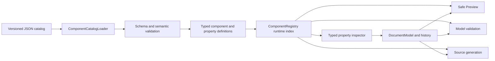

# Phase 6 Implementation Plan

## Purpose and status

This document is the detailed execution plan for Phase 6 of
MatlabAppClassDesigner. The Phase 6 section of `IMPLEMENTATION_PLAN.md` remains
the architectural and completion contract; this file records the implementation
order, concrete work packages, verification gates, and progress so the work can
be resumed without reconstructing prior design decisions.

**Status: in progress (6.1 complete, assessed 2026-08-11).**

**Target MATLAB release: R2024a.**

## Outcomes

Phase 6 will deliver:

- A strict, versioned JSON catalog containing the standard component and
  property specifications currently hard-coded in `ComponentRegistry.m`.
- A fail-closed loader that validates the catalog and constructs typed runtime
  definitions without executing catalog-provided code.
- A categorized inspector with typed editors for common and component-specific
  properties.
- Model-owned property add, change, and reset operations with undo/redo.
- Safe Preview updates and localized source edits for approved properties.
- An audited disposition for every candidate property of every Phase 4.5
  component and supported style.

Phase 6 does not execute input applications, evaluate arbitrary expressions,
install user callbacks on preview handles, copy referenced assets, or infer new
catalog support from the MATLAB release that happens to run the editor.

## Invariants

1. `DocumentModel` owns editable document state. Inspector controls and preview
   handles are disposable views.
2. `PropertyDefinition` describes capability; `PropertyEntry` describes one
   component instance. Unassigned, explicit literal, and source-backed
   nonliteral states remain distinct.
3. JSON contains declarative data only and cannot request arbitrary MATLAB code.
4. Catalog loading is atomic: one error prevents returning the entire registry.
5. Opened source is not executed; unknown and nonliteral source is preserved.
6. Selecting a component does not add redundant default assignments.
7. Existing source changes only through unambiguous owned spans and anchors.
8. Project-owned MATLAB source and tests retain the documented help, GPL,
   UTF-8-without-BOM, and CRLF requirements.

## Target architecture



Anticipated structure:

```text
resources/
  component-catalog/
    v1/
      catalog.json
      property-groups/
      components/
+macd/
  +catalog/
    ComponentCatalogLoader.m
    CatalogValidator.m
    PropertyBehaviorRegistry.m
  +model/
    ComponentRegistry.m
    ComponentDefinition.m
    PropertyDefinition.m
    PropertyEntry.m
    DocumentModel.m
  +ui/
    +inspector/
      PropertyEditorFactory.m
      ... typed editor adapters ...
tests/
  fixtures/
    componentCatalog/
  unit/
```

Names in the new packages may be adjusted when the first slice establishes the
smallest useful API, but parsing, schema validation, behavior resolution, editor
construction, and model mutation remain separate responsibilities.

## JSON catalog contract

### Manifest and file boundaries

`resources/component-catalog/v1/catalog.json` owns the schema version, target
MATLAB release, ordered property-group list, and ordered component-file list.
There is one component file per factory. The loader does not enumerate folders,
so ordering and omissions remain explicit and reviewable.

### Deterministic composition

Definitions are composed in this order:

1. Referenced shared property groups.
2. Component-local properties.
3. Style-specific additions, exclusions, and explicit overrides.

Duplicate factories, paths, or implicit overrides are errors. An override names
an existing definition and declares its intent. Property groups may not cycle,
and component files do not form unrestricted inheritance graphs.

### Data and behavior boundary

Ordinary values use standard JSON strings, logicals, finite numbers, arrays, and
objects. A MATLAB-specific value is allowed only through a schema-approved tagged
form parsed at the safe literal boundary. Catalog files never contain executable
MATLAB expressions.

Editor and validator fields contain symbolic identifiers such as `text`,
`rgbColor`, or `normalizedRgb`. `PropertyBehaviorRegistry` resolves only known
identifiers to project-owned implementations. Unknown identifiers fail loading;
the loader does not use `eval`, deserialize function handles, or invoke arbitrary
names through `str2func`.

### Validation and diagnostics

The loader rejects unknown or missing fields, unsupported schema versions,
duplicates, missing group/override targets, cycles, malformed defaults and
ranges, unknown behavior identifiers, invalid parent/style declarations, and
missing audit dispositions or omission reasons. Every error identifies its
catalog file and logical JSON path. No partial registry escapes a failed load.

## Work packages

### 6.1 Freeze the Phase 4.5 catalog baseline

- [x] Record a deterministic projection of every current registry definition.
- [x] Include factories, declared types, parents, creation arguments, properties,
  styles, overlay metadata, and resize constraints.
- [x] Add a baseline test insensitive to incidental struct-field ordering.

**Exit gate:** the current implementation reproduces a reviewed baseline under
licensed MATLAB R2024a.

**Completion record (2026-08-11):**
`tests/fixtures/componentCatalog/phase45-registry-baseline.json` freezes 38
factory definitions in a canonical JSON projection. `ComponentRegistryBaselineTest`
compares the runtime projection after sorting factories and recursively ordering
structure fields; it also parses the fixture independently. The licensed R2024a
run passed 2 baseline tests and 2 project-convention tests with zero failures.

### 6.2 Implement the JSON schema boundary and loader

- [ ] Define schema version 1, manifest, component/group documents, style
  overrides, tagged literals, and audit dispositions.
- [ ] Add explicit catalog-root injection for tests and packaged-resource
  resolution for the application.
- [ ] Implement strict validation, deterministic composition, normalization of
  `jsondecode` results, allowlisted behavior resolution, and atomic failure.
- [ ] Create minimal valid and intentionally invalid fixture catalogs.

**Required tests:** minimal load, deterministic order, explicit override, all
defined rejection paths, file/JSON-path diagnostics, fixture-root isolation, and
absence of partial results.

**Exit gate:** a fixture catalog constructs typed definitions without the
hard-coded standard catalog.

### 6.3 Migrate the Phase 4.5 component catalog

- [ ] Create the manifest and shared property groups.
- [ ] Move every existing factory into one component JSON file.
- [ ] Compare the loaded projection with the frozen Phase 4.5 baseline.
- [ ] Delegate `ComponentRegistry.createDefault()` to the loader.
- [ ] Remove hard-coded inventory only after parity passes.
- [ ] Verify parser fixtures, palette order, styles, overlays, and resize
  constraints remain unchanged.

**Required tests:** parity, existing registry/model/parser/preview tests, and real
editor construction, `drawnow`, validity assertion, and deletion.

**Exit gate:** JSON is the only standard catalog source with no Phase 4.5 behavior
change or duplicate MATLAB fallback.

### 6.4 Expand typed capabilities and reset history

- [ ] Add display/category/order, value schema, editor/validator identifiers,
  defaults, style/preview applicability, audit disposition, and reset policy to
  `PropertyDefinition`.
- [ ] Join definitions with entries without materializing defaults.
- [ ] Add model-owned property removal/reset and typed history for absent,
  literal, and source-backed states.
- [ ] Define safe removal rules for generated and parsed assignments.

**Required tests:** conversion, invalid definition rejection, absent versus
explicit state, add/change/reset undo/redo, redo-branch clearing, and parsed-state
restoration.

**Exit gate:** model tests prove all state transitions without UI or preview
handles as storage.

### 6.5 Build the categorized inspector framework

- [ ] Replace the editable literal table with a scrollable categorized inspector.
- [ ] Preserve selection, collapsed categories, and scroll position on refresh.
- [ ] Implement text, logical, enum, number, vector, color, and string-list
  adapters.
- [ ] Show inline validation without discarding invalid editor text.
- [ ] Route commits/reset through `DocumentModel` and coalesce gestures.
- [ ] Keep source-backed nonliteral values visible and read-only.

**Required tests:** real editor construction/draw/deletion, every adapter,
retained UI state, inline errors, read-only values, reset, and history.

**Exit gate:** the inspector has no component-specific conditionals; definitions
select every implemented editor.

### 6.6 Complete the Button vertical slice

- [ ] Audit R2024a push and state Button properties.
- [ ] Define Button content, alignment, icon, font, color, interactivity,
  position, callback-control, reference, and identity properties in JSON.
- [ ] Add missing Button adapters and validators.
- [ ] Apply supported visual changes to Safe Preview.
- [ ] Generate new assignments and localized replacement/insertion/removal.
- [ ] Compare manually with the supplied App Designer Button examples.

**Required tests:** all Button editors, style scope, defaults/reset, undo/redo,
Preview/runtime comparison, callback non-execution, both generators, and
byte-identical no-edit output.

**Exit gate:** Button works end to end through JSON, loader, registry, inspector,
model/history, Preview, validation, and source generation.

### 6.7 Expand audited component families

- [ ] Common controls and containers.
- [ ] Navigation and data controls.
- [ ] Axes and safely supported programmatic axes.
- [ ] Instrumentation components and supported styles.
- [ ] HTML and Figure Tools.
- [ ] Mark every candidate editable, visible read-only, or omitted with a reason.

Each family lands with JSON, shared-group changes, adapters/validators, registry
tests, representative Preview comparisons, and generator tests.

**Exit gate:** every Phase 4.5 factory/style has a complete audit and every
editable property names implemented allowlisted behavior.

### 6.8 Add specialized reference and file-backed editors

- [ ] Add model-owned selectors for `ContextMenu` and approved references.
- [ ] Preserve unsupported handle expressions as read-only source.
- [ ] Add `Icon`, `ImageSource`, and similar path editors without file copying,
  movement, or embedding.
- [ ] Explain and test relative paths from the app source location.
- [ ] Finish specialized list, color, range, and style adapters required by audit.

**Exit gate:** specialized values round-trip without evaluation, asset mutation,
or conversion of unsupported expressions to strings.

### 6.9 Complete Preview, validation, generation, and packaging

- [ ] Share the property schema between inspector and model validation.
- [ ] Apply only preview-safe values and report targeted mismatch diagnostics.
- [ ] Emit only explicit and structurally required new-app assignments.
- [ ] Edit only unambiguously owned parsed assignments.
- [ ] Verify catalog resources in the packaged application layout.
- [ ] Run the licensed MATLAB R2024a suite and manual visual procedure.

**Exit gate:** all Phase 6 criteria in `IMPLEMENTATION_PLAN.md` pass, with actual
automated counts and manual evidence recorded before completion.

## Verification matrix

| Layer | Required evidence |
| --- | --- |
| Catalog | Valid/invalid fixtures, deterministic merge, diagnostics, atomic failure |
| Registry | Phase 4.5 parity, complete audit, allowlisted identifiers |
| Model/history | Add/change/reset, absent state, undo/redo, parsed restoration |
| Inspector | Real construction/draw/deletion, adapters, errors, retained state |
| Safe Preview | Runtime comparison; callbacks and expressions never executed |
| Generators | New output, localized edits, no-edit identity, small diffs |
| Files | JSON UTF-8, MATLAB UTF-8 without BOM and CRLF, packaged discovery |

Focused suites run after each package. The full suite runs at catalog migration,
after Button, after each family when practical, and at Phase 6 completion. UI
tests construct the fixture, call `drawnow`, assert validity/state, and delete it;
parser or `checkcode` results alone are not UI verification.

## Commit and progress discipline

- Complete and verify one cohesive package or component family at a time.
- Commit each passing unit as a feature-sized local commit.
- Do not combine an `AGENTS.md` change with catalog, source, test, or plan work.
- Do not remove hard-coded inventory until the parity gate passes.
- Update checkboxes and record test evidence as work completes.
- Keep unrelated pre-existing worktree changes out of Phase 6 commits.

## Phase 6 completion checklist

- [ ] JSON is the only standard component/property catalog source.
- [ ] Loading is versioned, deterministic, allowlisted, and fail-closed.
- [ ] Every Phase 4.5 component/style has an audited property disposition.
- [ ] Every editable property has a typed, tested adapter and validator.
- [ ] Button acceptance works end to end in the supported scope.
- [ ] Property add/change/reset flows through shared model history.
- [ ] Safe Preview applies supported values without executing input code.
- [ ] New and parsed generation passes preservation/localized-diff tests.
- [ ] Packaged catalog discovery succeeds.
- [ ] Licensed MATLAB R2024a tests and manual visual checks pass.
