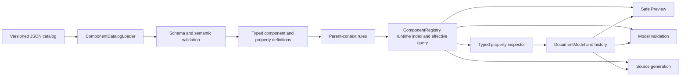

# Phase 6 Implementation Plan

## Purpose and status

This document is the detailed execution plan for Phase 6 of
MatlabAppClassDesigner. The Phase 6 section of `IMPLEMENTATION_PLAN.md` remains
the architectural and completion contract; this file records the implementation
order, concrete work packages, verification gates, and progress so the work can
be resumed without reconstructing prior design decisions.

**Status: in progress (6.1 and 6.2 complete, assessed 2026-08-11).**

**Target MATLAB release: R2024a.**

## Outcomes

Phase 6 will deliver:

- A strict, versioned JSON catalog containing the standard component and
  property specifications currently hard-coded in `ComponentRegistry.m`.
- A fail-closed loader that validates the catalog and constructs typed runtime
  definitions without executing catalog-provided code.
- A categorized inspector with typed editors for common and component-specific
  properties.
- Model-owned property add, change, and reset operations with undo/redo.
- Safe Preview updates and localized source edits for approved properties.
- An audited disposition for every candidate property of every Phase 4.5
  component and supported style.

Phase 6 does not execute input applications, evaluate arbitrary expressions,
install user callbacks on preview handles, copy referenced assets, or infer new
catalog support from the MATLAB release that happens to run the editor.

## Invariants

1. `DocumentModel` owns editable document state. Inspector controls and preview
   handles are disposable views.
2. `PropertyDefinition` describes capability; `PropertyEntry` describes one
   component instance. Unassigned, explicit literal, and source-backed
   nonliteral states remain distinct.
3. JSON contains declarative data only and cannot request arbitrary MATLAB code.
4. Catalog loading is atomic: one error prevents returning the entire registry.
5. Opened source is not executed; unknown and nonliteral source is preserved.
6. Selecting a component does not add redundant default assignments.
7. Existing source changes only through unambiguous owned spans and anchors.
8. Project-owned MATLAB source and tests retain the documented help, GPL,
   UTF-8-without-BOM, and CRLF requirements.

## Target architecture



Anticipated structure:

```text
resources/
  component-catalog/
    v1/
      catalog.json
      property-groups/
      components/
+macd/
  +catalog/
    ComponentCatalogLoader.m
    CatalogValidator.m
    PropertyBehaviorRegistry.m
  +model/
    ComponentRegistry.m
    ComponentDefinition.m
    ParentContextRule.m
    PropertyDefinition.m
    PropertyEntry.m
    DocumentModel.m
  +ui/
    +inspector/
      PropertyEditorFactory.m
      ... typed editor adapters ...
tests/
  fixtures/
    componentCatalog/
  unit/
```

Names in the new packages may be adjusted when the first slice establishes the
smallest useful API, but parsing, schema validation, behavior resolution, editor
construction, and model mutation remain separate responsibilities.

## JSON catalog contract

### Manifest and file boundaries

`resources/component-catalog/v1/catalog.json` owns the schema version, target
MATLAB release, ordered property-group list, and ordered component-file list.
There is one component file per factory. The loader does not enumerate folders,
so ordering and omissions remain explicit and reviewable.

### Deterministic composition

Definitions are composed in this order:

1. Referenced shared property groups.
2. Component-local properties.
3. Style-specific additions, exclusions, and explicit overrides.

Duplicate factories, paths, or implicit overrides are errors. An override names
an existing definition and declares its intent. Property groups may not cycle,
and component files do not form unrestricted inheritance graphs.

### Parent-dependent property applicability

Intrinsic definitions omit geometry supplied only by a direct parent. An
allowlisted context rule composes the effective surface after component/style
validation: Grid adds `Layout.Row` and `Layout.Column` and suppresses
`Position`; ordinary absolute parents add `Position`; structural parents add no
geometry unless explicitly reviewed. Hierarchy order and container references
remain separate relationship capabilities. Context-inapplicable opened-source
assignments are preserved read-only.

### Data and behavior boundary

Ordinary values use standard JSON strings, logicals, finite numbers, arrays, and
objects. A MATLAB-specific value is allowed only through a schema-approved tagged
form parsed at the safe literal boundary. Catalog files never contain executable
MATLAB expressions.

Editor and validator fields contain symbolic identifiers such as `text`,
`rgbColor`, or `normalizedRgb`. `PropertyBehaviorRegistry` resolves only known
identifiers to project-owned implementations. Unknown identifiers fail loading;
the loader does not use `eval`, deserialize function handles, or invoke arbitrary
names through `str2func`.

### Validation and diagnostics

The loader rejects unknown or missing fields, unsupported schema versions,
duplicates, missing group/override targets, cycles, malformed defaults and
ranges, unknown behavior identifiers, invalid parent/style declarations, and
missing audit dispositions or omission reasons. Every error identifies its
catalog file and logical JSON path. No partial registry escapes a failed load.

## Work packages

### 6.1 Freeze the Phase 4.5 catalog baseline

- [x] Record a deterministic projection of every current registry definition.
- [x] Include factories, declared types, parents, creation arguments, properties,
  styles, overlay metadata, and resize constraints.
- [x] Add a baseline test insensitive to incidental struct-field ordering.

**Exit gate:** the current implementation reproduces a reviewed baseline under
licensed MATLAB R2024a.

**Completion record (2026-08-11):**
`tests/fixtures/componentCatalog/phase45-registry-baseline.json` freezes 38
factory definitions in a canonical JSON projection. `ComponentRegistryBaselineTest`
compares the runtime projection after sorting factories and recursively ordering
structure fields; it also parses the fixture independently. The licensed R2024a
run passed 2 baseline tests and 2 project-convention tests with zero failures.

### 6.2 Implement the JSON schema boundary and loader

- [x] Define schema version 1, manifest, component/group documents, and strict
  style-override records. Expanded typed/audit fields remain owned by 6.5.
- [x] Add explicit fixture catalog-root injection and packaged-resource lookup.
- [x] Implement strict validation, deterministic composition, `jsondecode`
  normalization, allowlisted behavior resolution, and atomic failure.
- [x] Create isolated minimal valid and intentionally invalid test catalogs.

**Exit gate:** a fixture catalog constructs typed definitions without the
hard-coded standard catalog.

**Completion record (2026-08-11):** `ComponentCatalogLoader` and
`PropertyBehaviorRegistry` passed 5 loader tests, 2 baseline tests, and 2
project-convention tests under licensed R2024a. Commit: `9914aaa`.

### 6.3 Introduce parent-dependent property rules

- [x] Extend schema version 1 with allowlisted direct-parent context kinds and
  typed contributed/suppressed property rules.
- [x] Add one registry query such as `getEffectiveProperties(factory,
  parentFactory)` and prohibit duplicated consumer-side parent conditionals.
- [x] Define Grid context to add `Layout.Row`/`Layout.Column` and suppress
  `Position`; define ordinary absolute context to add `Position` only.
- [x] Define structural contexts for tab groups, button groups, trees, menus,
  and toolbars so broad property groups do not advertise invalid geometry.
- [x] Switch `DocumentModel.insertComponent`, `AppSourceParser` property
  recognition, and `ModelValidator` applicability checks to the shared query.
- [x] Preserve context-inapplicable opened-source assignments as read-only.
- [x] Split the 6.1 baseline into intrinsic definitions and representative
  direct-parent effective projections.
- [x] Eliminate the duplicate `uispinner` `Layout.Row`/`Layout.Column` entries
  through contextual composition rather than a compatibility exception.

**Required tests:** Grid/absolute insertion, nested Grid, deterministic effective
order, structural children, parser retention, invalid-parent diagnostics, and
canonical intrinsic/effective projections.

**Exit gate:** insertion, parsing, and validation resolve the same parent surface
without losing supported Grid placement or advertising invalid geometry.

**Completion record (2026-08-11):** Added `ParentContextRule`, the registry
effective-property query, Grid/absolute/structural contexts, insertion/parser/
validator integration, and strict JSON manifest loading of allowlisted rules.
The completion verification, including the safe inspector display regression,
passed 60 licensed R2024a tests with zero failures. Commits: `db5433f`,
`4798cd8`, `02196de`.

### 6.4 Migrate the Phase 4.5 component catalog

- [x] Create the manifest and shared intrinsic property groups.
- [x] Move every existing factory into one component JSON file.
- [x] Compare intrinsic and direct-parent effective projections with the revised
  frozen Phase 4.5 baselines.
- [x] Delegate `ComponentRegistry.createDefault()` to the loader.
- [x] Remove hard-coded inventory only after both parity layers pass.
- [x] Verify parser fixtures, palette order, styles, overlays, and resize
  constraints remain unchanged.

**Required tests:** intrinsic/effective parity, existing registry/model/parser/
preview tests, and real editor construction, `drawnow`, validity, and deletion.

**Exit gate:** JSON is the only standard catalog source with no effective Phase
4.5 behavior change or duplicate MATLAB fallback.

**Completion record (2026-08-11):** Migrated all 38 standard factories into
`resources/component-catalog/v1`, removed parent-dependent geometry from static
component definitions, and declared Grid, absolute, and structural contexts in
the manifest. Intrinsic definitions and every allowed direct-parent effective
surface are frozen independently. The licensed R2024a full suite passed after
migration.

### 6.5 Expand typed capabilities and reset history

- [ ] Add display/category/order, value schema, editor/validator identifiers,
  defaults, style/preview applicability, audit disposition, and reset policy to
  `PropertyDefinition`.
- [ ] Join effective definitions with entries without materializing defaults.
- [ ] Add model-owned property removal/reset and typed history for absent,
  literal, and source-backed states.
- [ ] Define safe removal rules for generated and parsed assignments.

**Required tests:** conversion, invalid definition rejection, absent versus
explicit state, add/change/reset undo/redo, redo-branch clearing, and parsed-state
restoration.

**Exit gate:** model tests prove all state transitions without UI or preview
handles as storage.

### 6.6 Build the categorized inspector framework

Phase 6.6 uses a simple native-control lifecycle. The inspector does not cache,
rebind, or diff individual controls across different selected components. It
rebuilds all category sections and property rows only when selection moves to a
different component or the selected component's effective property surface
changes. Re-selecting the current component and changing values, geometry,
validation, Preview, or history state update existing rows without rebuilding
them. This keeps lifecycle and callback ownership explicit while avoiding work
during frequent same-component edits.

The current effective-property `uitable` is a transitional integration surface.
It proves the model/registry join but is removed when the native categorized
view lands; it is not the final typed-editor implementation.

#### 6.6.1 Freeze inspector lifecycle and rebuild triggers

- [x] Introduce an inspector surface key containing component identity, factory,
  style, direct-parent factory, and the ordered effective-definition signature.
- [x] Split the current refresh path into `rebuildInspector` and
  `refreshInspectorValues` responsibilities.
- [x] Rebuild only when the selected component identity or surface key changes;
  make a repeated selection event for the current component a no-op.
- [x] Route drag/resize, property commit/reset, validation, Preview refresh, and
  undo/redo for the current surface through value/diagnostic synchronization.
- [x] Clear inspector view state and controls deterministically on New, Open,
  component deletion, and application destruction.

**Completion record (2026-08-11):** Added a surface key based on selected
component identity, factory, style, direct parent, ordered effective properties,
and source-only rows. Repeated hierarchy selection is a no-op; same-surface
refreshes synchronize values, while selection/surface changes take the rebuild
path. New and Open clear transient inspector state. The licensed R2024a editor,
model, and convention tests passed 24 tests with zero failures.

**Gate:** tests observe stable editor-control identity during same-component
updates and a complete replacement when selection or the effective surface
changes. No adapter callback retains a previously selected component ID.

#### 6.6.2 Build the native scrollable inspector shell

- [ ] Replace `InspectorTable` with one native scrollable container and an inner
  single-column layout that owns category sections.
- [ ] Add lightweight `InspectorView`, `InspectorCategorySection`, and
  `InspectorPropertyRow` responsibilities under `+macd/+ui/+inspector` rather
  than expanding component-specific logic in `MatlabAppClassDesigner`.
- [ ] Build a selected component's complete control tree off the active update
  path where practical, publish it once, and avoid `drawnow` inside row loops.
- [ ] Verify the public R2024a scrolling API used by the chosen native container
  with real construction, `drawnow`, validity, and deletion tests.

**Gate:** switching between representative small and large effective surfaces
constructs one valid inspector tree with no leaked controls, callbacks, or
timers; ordinary selection remains responsive under an observed smoke test.

#### 6.6.3 Render definition-driven categories and rows

- [ ] Extend and validate typed definition fields for category ID/display name,
  property display name, order, description/help, editor identifier, validator,
  audit disposition, style scope, preview policy, and reset policy.
- [ ] Sort categories and properties deterministically from catalog order data;
  do not infer categories from property paths in the UI.
- [ ] Render a consistent row structure containing label, editor host, optional
  reset action, inline diagnostic area, and explicit/default/read-only state.
- [ ] Append retained catalog-inapplicable or unknown opened-source entries to a
  dedicated Source category without evaluating or discarding them.

**Gate:** categories and row order are entirely definition-driven, and the
inspector contains no factory- or component-specific property conditionals.

#### 6.6.4 Define the adapter contract and allowlisted factory

- [ ] Define a project-owned adapter interface for control creation, model-to-UI
  loading, pending-text retention, validation, commit/reset availability,
  read-only presentation, focus, and deterministic cleanup.
- [ ] Resolve only allowlisted editor identifiers through
  `PropertyEditorFactory`; never use `eval`, `str2func`, or JSON class names.
- [ ] Keep current component/path binding in the property-row controller so
  adapters remain value editors and cannot mutate documents directly.
- [ ] Provide a read-only/unsupported adapter as a fail-closed presentation path
  for audited visible values that have no editable adapter.

**Gate:** unknown editor identifiers fail catalog loading, and every constructed
row owns exactly one adapter whose cleanup releases all listeners and controls.

#### 6.6.5 Implement common scalar adapters

- [ ] Implement text and multiline-text adapters.
- [ ] Implement logical and MATLAB `on`/`off` adapters using check boxes with
  explicit conversion rather than storing UI logicals accidentally.
- [ ] Implement enum adapters using definition-provided choices.
- [ ] Implement scalar-number adapters with definition-provided finite/range/
  integer constraints and retained invalid editor text.
- [ ] Add keyboard commit/cancel behavior consistently across scalar editors.

**Gate:** text, logical, on/off, enum, and scalar-number tests exercise real
controls and prove successful conversion, failed conversion, commit, reset,
undo, redo, and read-only behavior.

#### 6.6.6 Implement structured-value adapters

- [ ] Implement fixed/variable numeric-vector editing, including `Position`,
  limits, ticks, padding, and Grid row/column spans.
- [ ] Implement RGB color editing with a native color action plus an exact
  numeric representation that can round-trip.
- [ ] Implement string/item-list editing through a compact row summary and a
  dedicated native editor dialog; preserve row/column string-array shape where
  the schema requires it.
- [ ] Keep table data, mixed Grid size lists, datetime, file/image paths,
  component references, callbacks, and other specialized values on explicit
  read-only/fallback adapters until their later audited phases.

**Gate:** vector, color, and string-list adapters round-trip supported values and
show a typed read-only fallback for every deferred structured value.

#### 6.6.7 Connect validation, model mutation, reset, and history

- [ ] Store uncommitted editor text and inline diagnostics only in inspector view
  state; the document, Preview, and generators continue using the last valid
  committed value.
- [ ] Validate through named validators before calling
  `DocumentModel.setProperty`; failed edits change neither model nor history.
- [ ] Route reset through model-owned reset/removal rules, display effective
  defaults without materializing entries, and explain disabled parsed resets.
- [ ] Coalesce a continuous editor gesture into one history record while keeping
  discrete commits separate and clearing redo branches correctly.
- [ ] Synchronize successful commit/reset/undo/redo back into existing rows
  without rebuilding the current surface.

**Gate:** model tests cover absent, literal, and source-backed states, while UI
tests prove inline errors retain user input and valid history transitions do not
replace editor controls.

#### 6.6.8 Preserve per-component transient view state

- [ ] Save collapsed category IDs, scroll position when exposed by the verified
  R2024a public API, focused property, and pending invalid editor text before a
  selected component's control tree is destroyed.
- [ ] Restore compatible state when returning to that component; discard entries
  whose definitions or adapter kinds no longer match the current surface.
- [ ] Keep this cache editor-owned and clear it on document replacement or
  component deletion; never serialize it as document or generated-source state.
- [ ] Preserve state automatically during same-component value refresh by not
  rebuilding the control tree.

**Gate:** selection A -> B -> A restores compatible view state, repeated A -> A
does not rebuild, and New/Open cannot inherit state from the prior document.

#### 6.6.9 Remove the transitional table and complete integration

- [ ] Remove `InspectorTable`, `InspectorPaths`, table cell-edit routing, and
  obsolete formatter-only assumptions after native rows cover their behavior.
- [ ] Keep unsupported literals and nonliteral expressions visible through the
  new read-only adapter with typed `<unsupported: ...>` summaries where useful.
- [ ] Run real editor construction/draw/deletion tests for every adapter,
  selection lifecycle, categories, inline validation, reset, and history.
- [ ] Run the licensed R2024a full suite and record actual counts, observed
  selection responsiveness, known deferred adapters, and completion commits.

**Required tests:** real editor construction/draw/deletion, every adapter,
rebuild/no-rebuild triggers, retained UI state, inline errors, read-only values,
reset, history, and deterministic cleanup.

**Exit gate:** the inspector has no component-specific conditionals; definitions
select every implemented editor. Different-component selection rebuilds a clean
native control tree, while same-component edits synchronize values without
rebuilding or losing transient editor state.

### 6.7 Complete the Button vertical slice

- [ ] Audit R2024a push and state Button properties.
- [ ] Define Button content, alignment, icon, font, color, interactivity,
  callback-control, reference, and identity properties in JSON; obtain geometry
  properties from the parent context.
- [ ] Add missing Button adapters and validators.
- [ ] Apply supported visual changes to Safe Preview.
- [ ] Generate new assignments and localized replacement/insertion/removal.
- [ ] Compare manually with the supplied App Designer Button examples.

**Required tests:** all Button editors, style scope, defaults/reset, undo/redo,
Preview/runtime comparison, callback non-execution, both generators, and
byte-identical no-edit output.

**Exit gate:** Button works end to end through JSON, loader, registry, inspector,
model/history, Preview, validation, and source generation.

### 6.8 Expand audited component families

- [ ] Common controls and containers.
- [ ] Navigation and data controls.
- [ ] Axes and safely supported programmatic axes.
- [ ] Instrumentation components and supported styles.
- [ ] HTML and Figure Tools.
- [ ] Mark every candidate editable, visible read-only, or omitted with a reason.

Each family lands with JSON, shared-group changes, adapters/validators, registry
tests, representative Preview comparisons, and generator tests.

**Exit gate:** every Phase 4.5 factory/style has a complete audit and every
editable property names implemented allowlisted behavior.

### 6.9 Add specialized reference and file-backed editors

- [ ] Add model-owned selectors for `ContextMenu` and approved references.
- [ ] Preserve unsupported handle expressions as read-only source.
- [ ] Add `Icon`, `ImageSource`, and similar path editors without file copying,
  movement, or embedding.
- [ ] Explain and test relative paths from the app source location.
- [ ] Finish specialized list, color, range, and style adapters required by audit.

**Exit gate:** specialized values round-trip without evaluation, asset mutation,
or conversion of unsupported expressions to strings.

### 6.10 Complete Preview, validation, generation, and packaging

- [ ] Share the property schema between inspector and model validation.
- [ ] Apply only preview-safe values and report targeted mismatch diagnostics.
- [ ] Emit only explicit and structurally required new-app assignments.
- [ ] Edit only unambiguously owned parsed assignments.
- [ ] Verify catalog resources in the packaged application layout.
- [ ] Run the licensed MATLAB R2024a suite and manual visual procedure.

**Exit gate:** all Phase 6 criteria in `IMPLEMENTATION_PLAN.md` pass, with actual
automated counts and manual evidence recorded before completion.

## Verification matrix

| Layer | Required evidence |
| --- | --- |
| Catalog | Valid/invalid fixtures, deterministic merge, diagnostics, atomic failure |
| Registry | Intrinsic/context parity, complete audit, allowlisted identifiers |
| Model/history | Add/change/reset, absent state, undo/redo, parsed restoration |
| Inspector | Real construction/draw/deletion, adapters, errors, retained state |
| Safe Preview | Runtime comparison; callbacks and expressions never executed |
| Generators | New output, localized edits, no-edit identity, small diffs |
| Files | JSON UTF-8, MATLAB UTF-8 without BOM and CRLF, packaged discovery |

Focused suites run after each package. The full suite runs after parent-context
integration, at catalog migration,
after Button, after each family when practical, and at Phase 6 completion. UI
tests construct the fixture, call `drawnow`, assert validity/state, and delete it;
parser or `checkcode` results alone are not UI verification.

## Commit and progress discipline

- Complete and verify one cohesive package or component family at a time.
- Commit each passing unit as a feature-sized local commit.
- Do not combine an `AGENTS.md` change with catalog, source, test, or plan work.
- Do not remove hard-coded inventory until the 6.4 intrinsic/effective parity
  gate passes.
- Update checkboxes and record test evidence as work completes.
- Keep unrelated pre-existing worktree changes out of Phase 6 commits.

## Phase 6 completion checklist

- [ ] JSON is the only standard component/property catalog source.
- [ ] Loading is versioned, deterministic, allowlisted, and fail-closed.
- [ ] One typed registry API resolves intrinsic and direct-parent effective
  properties for insertion, parsing, validation, and the inspector.
- [ ] Every Phase 4.5 component/style has an audited property disposition.
- [ ] Every editable property has a typed, tested adapter and validator.
- [ ] Button acceptance works end to end in the supported scope.
- [ ] Property add/change/reset flows through shared model history.
- [ ] Safe Preview applies supported values without executing input code.
- [ ] New and parsed generation passes preservation/localized-diff tests.
- [ ] Packaged catalog discovery succeeds.
- [ ] Licensed MATLAB R2024a tests and manual visual checks pass.
